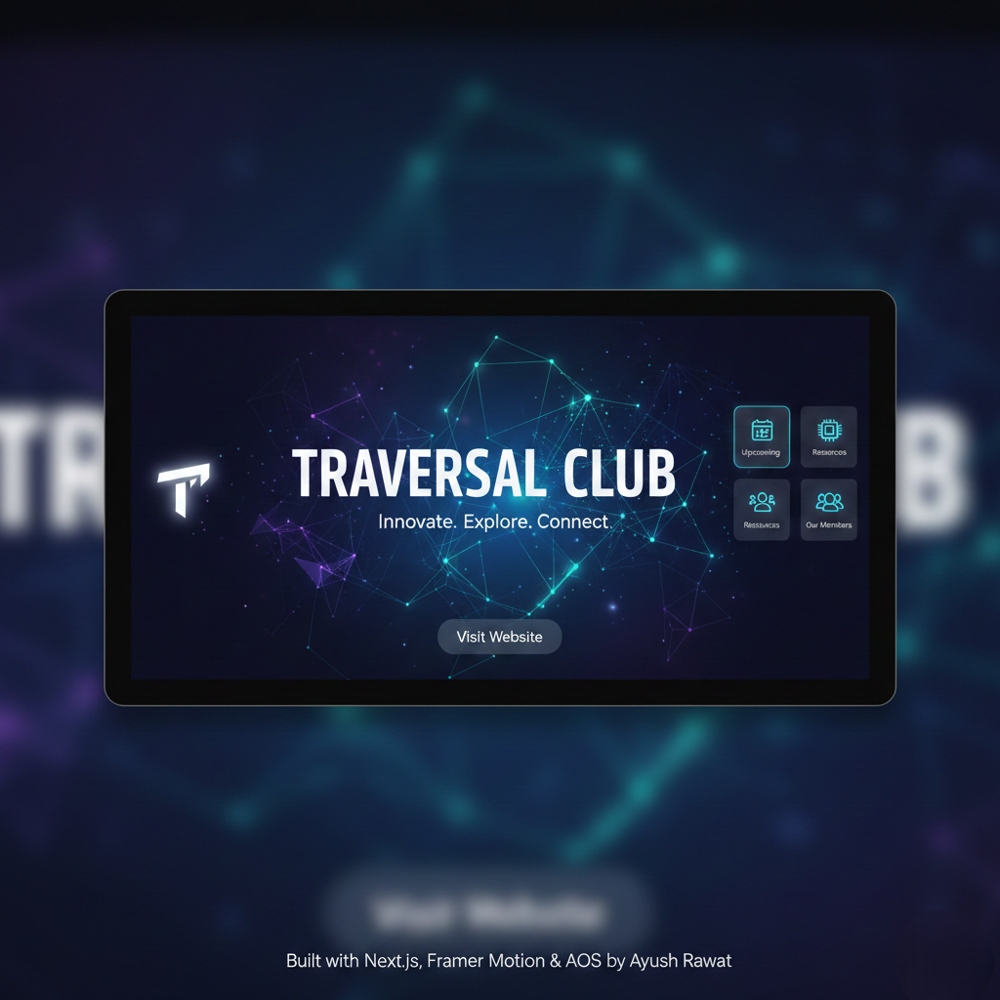

<p align="center">
  
</p>

# Traversal - Official Club Website

A premium, high-performance web application built to serve as the digital headquarters for the **Traversal Club**. This platform centralizes event management, member showcases, and student resources into a single, cohesive user experience.

> **Explore the Live Site:** [www.traversalhub.in](https://www.traversalhub.in/) 🚀

---

## 🛠️ Technical Implementation
This project was developed entirely solo by me, from the initial architectural design to the final deployment. The goal was to build a scalable, modern interface that stands out through performance and sophisticated motion design.

### **Core Stack**
* **Framework:** **Next.js (App Router)** – Leveraged for optimized routing and Server-Side Rendering (SSR) to ensure fast load times and SEO friendliness.
* **Styling:** **PostCSS** – Ensuring a lightweight and responsive CSS architecture that adapts to any screen size.
* **Animation System:** * **Framer Motion:** Used for complex, physics-based micro-interactions, spring-based animations, and smooth layout transitions.
    * **AOS (Animate On Scroll):** Orchestrated scroll-triggered entry animations to create a professional, cinematic flow as users explore the site.

---

## 📄 Pages & Features
I designed and developed several key pages to provide a comprehensive experience for the student community:

* **Home Page:** A high-impact landing page featuring a hero section with custom animations to grab user attention immediately.
* **About Us:** A deep dive into the Traversal Club's mission, vision, and our journey at GEU.
* **Events Gallery:** A dynamic showcase of past and upcoming events, using **AOS** to reveal event cards elegantly.
* **Team Section:** A dedicated space highlighting the core members and their specific contributions to the club.
* **Resources:** A hub for students to find initiatives, learning opportunities, and club-specific materials.

---

## 📦 Key Libraries Used
| Library | Purpose |
| :--- | :--- |
| **Next.js** | Core framework providing the foundation and routing. |
| **Framer Motion** | Advanced component-level animations and interactive states. |
| **AOS** | Scroll-triggered animations for visual storytelling. |
| **React** | Component-based UI development and state management. |
| **PostCSS** | Modern CSS processing for a clean, professional finish. |

---
---

## 📂 Architecture
```

I structured this project using the **Next.js App Router** for optimal performance and maintainability.

```bash
├── app/                  # Main application logic (Pages, Layouts, Components)
├── public/               # Static assets (Logos, Icons, Images)
├── .gitignore            # Git exclusion rules
├── README.md             # Project documentation
├── eslint.config.mjs     # Linting rules for code cleanliness
├── jsconfig.json         # Absolute path configurations
├── next.config.mjs       # Performance and build optimizations
├── package-lock.json     # Locked dependency versions
├── package.json          # Dependency management and scripts
└── postcss.config.mjs    # CSS processing configuration

```

---

## 👥 Credits & Development

This project is a result of a collaborative vision, brought to life through dedicated engineering and design.

* 💻 **Website Creator & Lead Developer:** [Ayush Rawat](https://github.com/Ayushrf121)
  * Responsible for the entire technical architecture, frontend engineering, animation logic, and deployment.
* 🎨 **UI/UX Design:** Kush Sahu
  * Responsible for the visual language, wireframing, and user interface design.

---

## 👤 About the Developer: Ayush Rawat

I handled the end-to-end development of this project, translating complex designs into a high-performance web experience.

* 🌐 **Portfolio:** [Ayush Rawat Portfolio](https://portfolio-chi-eight-5dltnxj7ew.vercel.app/)
* 💼 **LinkedIn:** [Ayush Rawat](https://www.linkedin.com/in/ayush-rawat-745854326?utm_source=share_via&utm_content=profile&utm_medium=member_android)
* 💻 **GitHub:** [@Ayushrf121](https://github.com/Ayushrf121)
---


